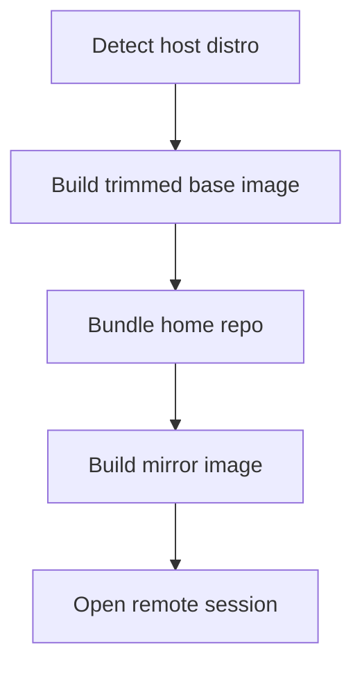

# Distro Mirror CLI

A CLI tool that detects the current Linux distribution, generates a trimmed Docker image, and manages home repo mirrors, synchronization, and remote sessions.

## 🚀 Overview

- Detect host distro metadata and build a minimal Docker context.
- Initialize a home repository mirror and bundle it into an image.
- Sync branches between local repos and mirror repos.
- Track remote desktop or SSH sessions with repeatable commands.

## 🧭 Command Map

| 🔧 Command | ✅ Purpose | 📦 Output |
| --- | --- | --- |
| `image plan` | Preview base image and trim packages | Console plan |
| `image build` | Write Dockerfile (optionally build) | `Dockerfile`, `mirror-plan.json` |
| `repo init` | Create a home repo mirror | Bare or working repo |
| `repo sync` | Push/pull branches to a mirror repo | Synced refs |
| `repo bundle` | Bundle a repo into a portable file | `.bundle` file |
| `repo mirror-build` | Build a mirror image with a bundle | Docker context |
| `repo mirror-run` | Run the mirror image | Container run command |
| `session create` | Save remote session metadata | `sessions.json` |
| `session open` | Print or run session command | CLI command |

## 🐳 Quick Start

```bash
python -m distromirror image build --context .distro-mirror/build
python -m distromirror repo init --path ~/.local/share/distro-mirror/home_repo
python -m distromirror repo sync --source ~/src/project --mirror ~/.local/share/distro-mirror/home_repo
python -m distromirror repo mirror-build --repo ~/src/project --context .distro-mirror/mirror-image
python -m distromirror session create --type rdp --target lab-host:3389 --label lab-rdp
python -m distromirror session open --label lab-rdp
```

## 🧩 Workflow



## 🧪 BDD Tests

```bash
pip install -r requirements-dev.txt
behave
```

## 🔧 Configuration

- `DISTRO_MIRROR_HOME`: override the default storage directory (`~/.local/share/distro-mirror`).
- Session metadata is stored in `sessions.json` under the home directory.

## 📄 License

MIT
